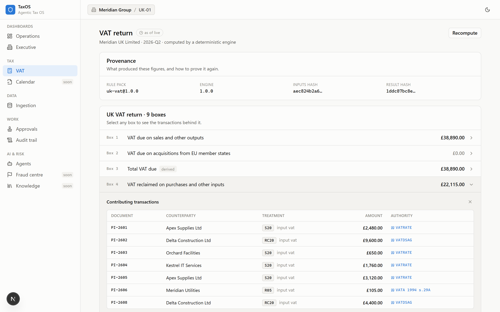
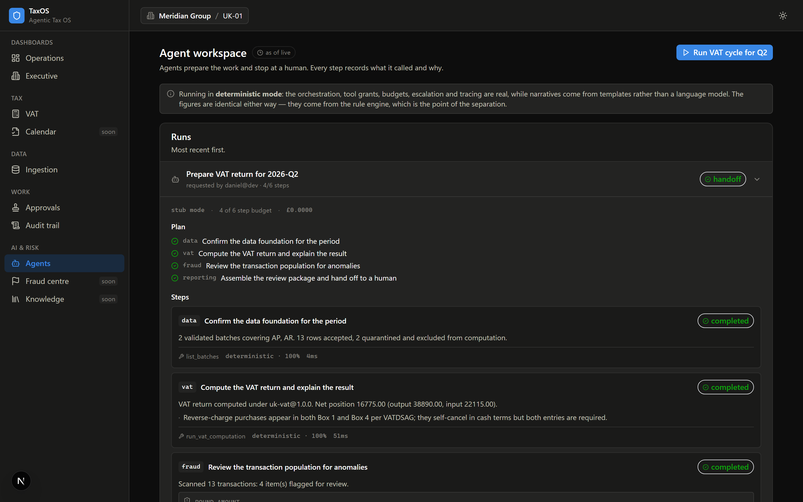
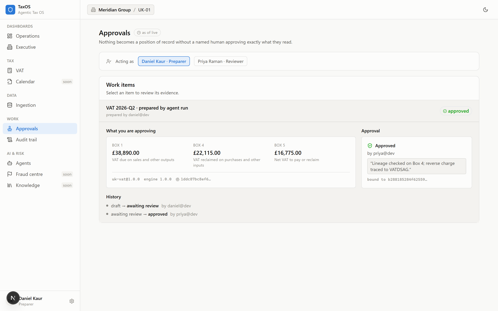
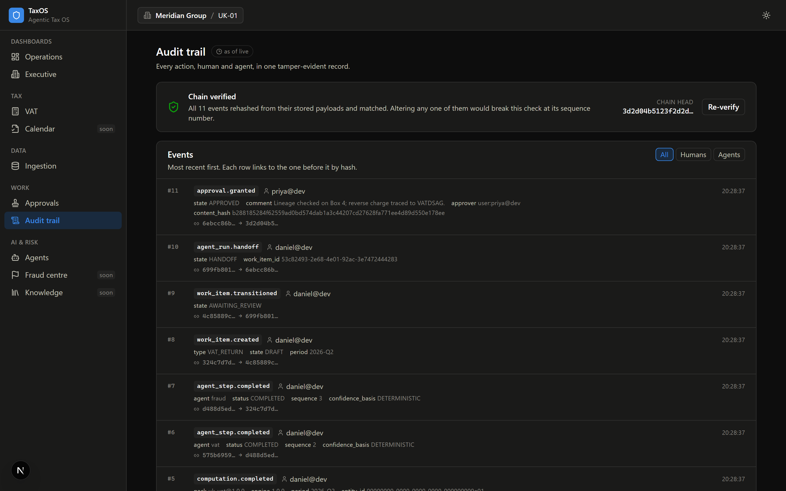
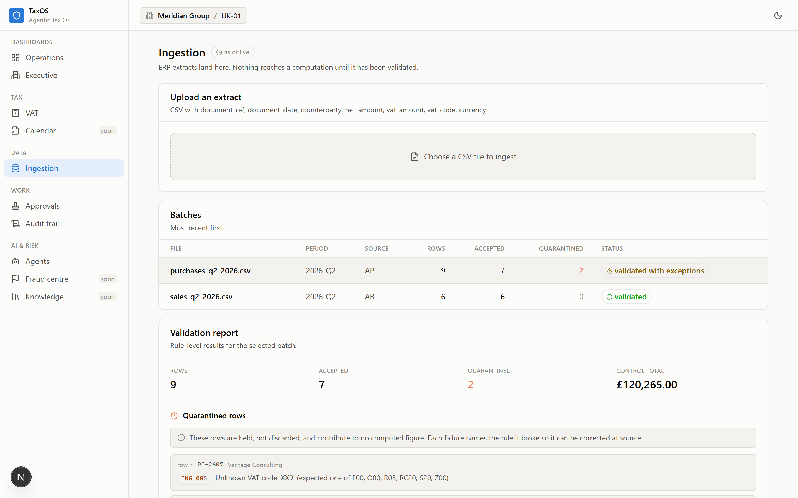
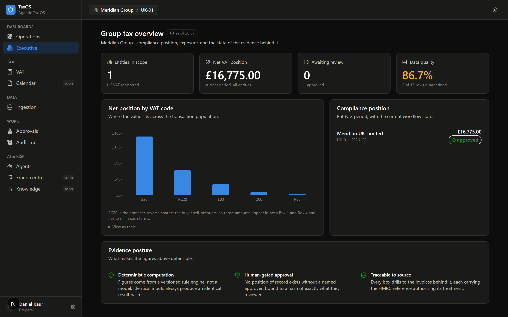
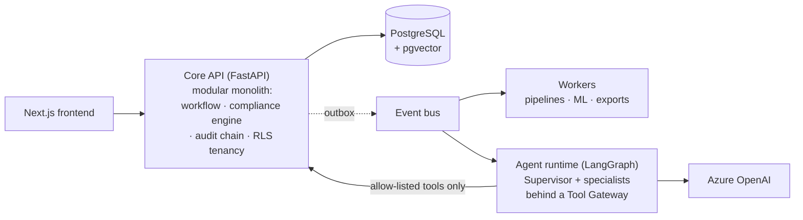

<div align="center">

# TaxOS — Enterprise Agentic Tax Operating System

**An autonomous multi-agent AI platform for enterprise tax compliance —
where agents prepare the work, evidence is generated by default, and humans stay in command.**

[](/) [](/) [](docs/architecture/README.md) [](/) [](/) [](/)

*UK VAT lifecycle, running: ingest → validate → deterministic computation → agent orchestration
→ human approval → tamper-evident audit → executive reporting.*

[Architecture](docs/architecture/README.md) · [AI Design](docs/ai/README.md) · [Documentation Portal](docs/README.md)

```bash
just up && just demo     # five minutes to a working platform, no API keys
```

</div>

---

## Why this exists

Enterprise tax functions spend 50–70% of their capacity on data wrangling and manual computation while regulators digitise faster than corporates can respond. Existing platforms automate *forms*; research copilots answer *questions*. Nobody ships the middle: **governed agentic execution** — AI that carries compliance work from raw ERP extracts to a review-ready, evidence-attached state under human control.

TaxOS demonstrates that layer, built to the standard of an internal Big Four platform asset:

- **Agents prepare; humans approve.** No filing, adjustment, or external communication happens without a named human approval bound to a content hash. The approval gate is architectural — agent-callable endpoints for approval *do not exist*.
- **LLMs never calculate tax.** A deterministic, versioned rule engine (signed jurisdiction content packs, decimal arithmetic, property-tested reproducibility) computes every figure. Agents reason, explain, and orchestrate around it.
- **Evidence by default.** Every mutation commits atomically with a hash-chained audit event; every figure traces to source transactions; every AI claim cites a resolvable source or is rejected before a human sees it.
- **Explainable ML.** Fraud and risk models are chosen for exact explainability (TreeSHAP), scored against reviewer capacity, and governed through a registry where production promotion requires human approval — like any other state change of record.

## The product

**Every figure drills to its evidence.** Click any box on the VAT return and the invoices behind it appear — each carrying the HMRC reference that authorises its treatment, with the contributions reconciling to the box exactly.



**Agents prepare; they cannot approve.** A run plans, checks the data foundation, computes deterministically, scans for anomalies, and stops at a work item. Every step records the tools it called, its confidence *and the basis for it*, and its duration.



<details>
<summary><strong>More screens</strong> — approvals, audit trail, ingestion, executive dashboard (light &amp; dark)</summary>

**Approvals — segregation of duties, visible.** As the preparer the button is disabled beneath the words *"You prepared this item — a second reviewer is required."* Switch seats and it enables; the granted approval displays the content hash it is bound to.



**Audit trail — the log, provable.** Every event rehashed from its stored payload; each row shows its hash link to the one before it.



**Ingestion — validation as the point of the screen.** Quarantined rows show the rule id, a human-readable message, and the row's own data: enough to fix it at source rather than guess.



**Executive dashboard.** Compliance position, exposure, and the state of the evidence behind it.



*All screenshots are generated by `uv run python tools/assets/capture.py` against the running application — an image that cannot be regenerated rots the moment the UI moves.*

</details>

## The 60-second architecture



Five deployables, one system of record, one auditable mutation path. Same artifacts run on **docker compose**, **Azure Container Apps**, and **Kubernetes** (Helm charts CI-validated on every PR). 18 Architecture Decision Records document every significant trade-off — including the roads not taken.

## What actually runs

The R1 vertical slice is built and working against real PostgreSQL — not mocks, not slideware:

| Step | What happens | Try it |
|---|---|---|
| **Ingest** | ERP extract uploaded, validated row by row; failures quarantined with the rule they broke | `/data/batches` |
| **Compute** | Deterministic engine produces the 9-box return; identical inputs always yield an identical result hash | `/tax/vat` |
| **Trace** | Every box drills to its invoices, each carrying the HMRC reference authorising its treatment — and the contributions reconcile to the box exactly | click any box |
| **Orchestrate** | Agent run: data readiness → computation → anomaly scan → handoff, every step recording its tools, confidence basis, and cost | `/agents` |
| **Approve** | Segregation of duties enforced; approval binds to a hash of exactly what was reviewed | `/work/approvals` |
| **Prove** | Hash-chained audit trail, verifiable on demand — a break is located by sequence number | `/audit` |
| **Report** | Executive dashboard over live aggregates | `/dashboard` |

`just demo` runs the whole story in one command: it seeds the data, executes the agent cycle, shows the approval gate refusing the preparer *by name*, approves as the reviewer, and verifies the audit chain.

**101 tests**, many of which encode the architecture's claims rather than merely its behaviour — `test_unaudited_mutation_cannot_commit`, `test_rls_blocks_cross_tenant_read`, `test_run_completes_in_handoff_never_approved`, `test_agent_output_contains_no_authored_figures`. Breaking one is definitionally an architecture change requiring an ADR update.

## Quick start

```bash
git clone <repo> && cd taxos
just up          # Postgres + Redis + migrations (< 5 min to a working platform)
just demo        # seed, run the agent cycle, verify the chain
just api & just web
```

No cloud account and no API keys. The agent runtime runs in **deterministic mode**: orchestration, tool grants, budgets, escalation, and tracing are all real, while narratives come from templates rather than a language model. The figures are identical either way, because they come from the rule engine — which is precisely the point of separating reasoning from arithmetic. Full guide: [Installation & Deployment](docs/guides/deployment-guide.md).

## What to look at (reviewer's shortlist)

| If you care about… | Start here |
|---|---|
| System design & trade-offs | [Architecture guide](docs/architecture/README.md) + [ADR log](docs/architecture/README.md#adr-index) |
| Agentic AI done governably | [AI architecture](docs/ai/README.md) — framework evaluation, 13 agent specs, eval harness |
| The security story | [Threat model](docs/security/01-threat-model.md) + [prompt-injection catalogue](docs/security/02-ai-security.md) |
| RAG with real grounding | [Knowledge management](docs/knowledge/README.md) — citations as typed objects, 9-layer hallucination stack |
| ML engineering judgement | [ML estate](docs/ml/README.md) — cold-start ladder, alert-budget thresholds, TreeSHAP-only explainability |
| Engineering discipline | [Invariant test suite](docs/backend/06-testing.md) — the architecture as executable tests |
| Product thinking | [Discovery](docs/discovery/README.md) + [frontend design system](docs/frontend/README.md) |

## Status & scope

**Built and running (R1):** ingestion, the deterministic VAT engine with lineage, the agent runtime, the approval gate, the audit chain, and the executive dashboard — with tests, migrations, and a one-command demo.

**Designed, not yet built:** the RAG knowledge layer (Phase 4), the supervised ML estate (Phase 5), Azure deployment (Phase 8), and the remaining screens. Each is specified to implementation depth in its phase documents — the roadmap in [docs/discovery/05-roadmap.md](docs/discovery/05-roadmap.md) is the honest sequence.

Anchor jurisdiction: **UK/HMRC** — VAT to working depth; CT, WHT and TP staged. Jurisdictions are data-driven content packs, not code, so adding one is authoring rather than engineering.

**Honest positioning:** a portfolio-grade demonstration of enterprise platform engineering — synthetic data, an illustrative (but cited) tax-rule subset, and a compliance posture that is *mapped* to ISO 27001 / SOC 2 rather than certified against them. Every simplification is documented where it lives rather than glossed here.

---

<sub>Built by [Olisa Anthony](https://github.com/Antonini28) — MSc AI, ex-PwC Tax Technology. Security contact: see [SECURITY.md](SECURITY.md).</sub>
