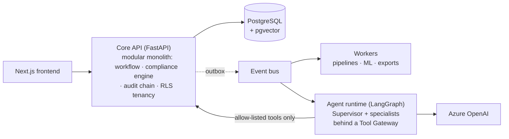

<div align="center">

# TaxOS — Enterprise Agentic Tax Operating System

**An autonomous multi-agent AI platform for enterprise tax compliance —
where agents prepare the work, evidence is generated by default, and humans stay in command.**

[](/) [](/) [](/) [](/) [](/) [](/)

*UK VAT lifecycle end-to-end: ingest → validate → deterministic computation → anomaly detection →
agent orchestration → human approval → evidence pack → executive reporting.*

[Architecture](docs/architecture/README.md) · [AI Design](docs/ai/README.md) · [Live Demo](/) · [Documentation Portal](docs/README.md)

</div>

---

## Why this exists

Enterprise tax functions spend 50–70% of their capacity on data wrangling and manual computation while regulators digitise faster than corporates can respond. Existing platforms automate *forms*; research copilots answer *questions*. Nobody ships the middle: **governed agentic execution** — AI that carries compliance work from raw ERP extracts to a review-ready, evidence-attached state under human control.

TaxOS demonstrates that layer, built to the standard of an internal Big Four platform asset:

- **Agents prepare; humans approve.** No filing, adjustment, or external communication happens without a named human approval bound to a content hash. The approval gate is architectural — agent-callable endpoints for approval *do not exist*.
- **LLMs never calculate tax.** A deterministic, versioned rule engine (signed jurisdiction content packs, decimal arithmetic, property-tested reproducibility) computes every figure. Agents reason, explain, and orchestrate around it.
- **Evidence by default.** Every mutation commits atomically with a hash-chained audit event; every figure traces to source transactions; every AI claim cites a resolvable source or is rejected before a human sees it.
- **Explainable ML.** Fraud and risk models are chosen for exact explainability (TreeSHAP), scored against reviewer capacity, and governed through a registry where production promotion requires human approval — like any other state change of record.

## The 60-second architecture



Five deployables, one system of record, one auditable mutation path. Same artifacts run on **docker compose**, **Azure Container Apps**, and **Kubernetes** (Helm charts CI-validated on every PR). 18 Architecture Decision Records document every significant trade-off — including the roads not taken.

## Quick start

```bash
git clone <repo> && cd taxos
just up          # compose stack + migrate + seed (< 5 min to working platform)
just demo        # seeded demo: flagship agent run in stub-LLM mode → executive dashboard
```

No cloud account or API keys required — a dev OIDC issuer provides persona logins (Head of Tax, Tax Ops, Risk Lead, CFO, Admin, Auditor) and stub-LLM mode replays recorded agent runs. Full guide: [Installation & Deployment](docs/guides/deployment-guide.md).

## What to look at (reviewer's shortlist)

| If you care about… | Start here |
|---|---|
| System design & trade-offs | [Architecture guide](docs/architecture/README.md) + [ADR log](docs/architecture/README.md#adr-index) |
| Agentic AI done governably | [AI architecture](docs/ai/README.md) — framework evaluation, 13 agent specs, eval harness |
| The security story | [Threat model](docs/security/01-threat-model.md) + [prompt-injection catalogue](docs/security/02-ai-security.md) |
| RAG with real grounding | [Knowledge management](docs/knowledge/README.md) — citations as typed objects, 9-layer hallucination stack |
| ML engineering judgement | [ML estate](docs/ml/README.md) — cold-start ladder, alert-budget thresholds, TreeSHAP-only explainability |
| Engineering discipline | [Invariant test suite](docs/backend/06-testing.md) — the architecture as executable tests |
| Product thinking | [Discovery](docs/discovery/README.md) + [frontend design system](docs/frontend/README.md) |

## Status & scope

Anchor jurisdiction: **UK/HMRC** (VAT to production depth; CT/WHT/TP staged) — jurisdictions are data-driven content packs, not code. Delivery runs in four release trains (R1 foundation → R4 scale); current state and roadmap: [docs/discovery/05-roadmap.md](docs/discovery/05-roadmap.md).

**Honest positioning:** this is a portfolio-grade demonstration of enterprise platform engineering — synthetic data, illustrative (cited) tax-rule subset, mapped-not-certified compliance posture. Every simplification is documented where it lives.

---

<sub>Built by [Olisa Anthony](https://github.com/Antonini28) — MSc AI, ex-PwC Tax Technology. Security contact: see [SECURITY.md](SECURITY.md).</sub>
