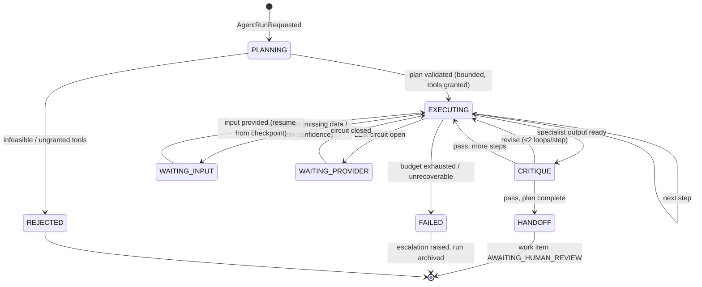

# 02 — Agent System Design

## 1. Orchestration model

One **Supervisor graph** per run; specialist agents are subgraphs invoked with typed envelopes (Phase 2, doc 10 §6). The Supervisor compiles a bounded plan; LangGraph edges encode the only legal transitions.



Invariants (enforced structurally, tested in CI):
- No edge exists from any agent state to approval/filing — `HANDOFF` is terminal (GP-1).
- Every state transition checkpoints to Postgres and emits `AgentRunStateChanged` (WS live view).
- Budgets (tokens £, tool calls, wall clock, steps) are decremented in state; exhaustion routes to `FAILED`→escalation, never silent truncation.

## 2. Run lifecycle & the envelope contract

```python
# contracts/agents.py (shared package — framework-free, versioned)
class TaskEnvelope(BaseModel):
    envelope_version: str = "1.0"
    run_id: UUID; step_id: str
    agent: AgentName                    # registry key
    goal: str                           # imperative, single outcome
    context_refs: list[ResourceRef]     # typed refs (batch, obligation, computation…) — never raw data
    constraints: Constraints            # jurisdiction, period, entity scope
    budget: StepBudget                  # tokens, tool_calls, wall_clock_s
    deadline: datetime | None

class ResultEnvelope(BaseModel):
    envelope_version: str = "1.0"
    run_id: UUID; step_id: str; agent: AgentName
    status: Literal["COMPLETED","ESCALATED","FAILED"]
    output: AgentOutput                 # discriminated union per agent type
    confidence: Confidence              # score + basis (see §5)
    citations: list[Citation]           # knowledge/lineage refs backing claims
    cost: CostRecord                    # tokens, £, latency, model versions
    escalation: Escalation | None       # reason, needed_input, suggested_owner
```

`context_refs` not raw data is a security decision: the agent resolves refs through allow-listed Tool Gateway reads under its own grants — the Supervisor cannot smuggle data an agent isn't entitled to see.

## 3. Memory architecture (the "Memory Agent", done properly)

Four tiers, all deterministic storage with deterministic write policies — no LLM decides what is remembered (an LLM curating its own memory is an unauditable feedback loop; rejected explicitly):

| Tier | Contents | Store | Write policy | Read policy |
|---|---|---|---|---|
| **Working** (per run) | Graph state: plan, step results, budgets | LangGraph Postgres checkpointer | Every transition | Own run only |
| **Episodic** (cross-run) | Structured run summaries: goal, outcome, escalations, corrections received | `agent_episode` table | RunTracer writes at HANDOFF/FAILED — templated summary, not free text | Supervisor planning reads last-N for same (entity, obligation type): "payroll extract was late last 3 quarters → check first" |
| **Semantic** (domain knowledge) | Knowledge corpus (R2 RAG), rule-pack citations | pgvector + FTS (ADR-002) | Knowledge pipeline only (governed ingestion) | Research/domain agents via `search_knowledge` tool |
| **Procedural** | Prompts, few-shot exemplars, rubric definitions | Versioned in repo (`prompts/` with semver + changelog) | PR review only — prompt changes are code changes with eval gates (doc 05) | Loaded by registry at agent construction |

Tenant isolation applies to all tiers (episodic memory is tenant-scoped — cross-client learning is a data-governance decision for the enterprise edition, default **off**).

## 4. Model routing & cost governance

| Route | Model tier (Azure OpenAI deployments) | Used by |
|---|---|---|
| `reasoning` | Frontier reasoning model (e.g. o-series/GPT-5-class deployment) | Supervisor planning, Critic, CT/TP analysis |
| `standard` | Flagship general model | VAT/Research/Reporting narrative drafting |
| `fast` | Small/mini model | Extraction, classification, formatting, summarising tool outputs |
| `embed` | Embedding model | Knowledge pipeline |

Routing is per-node config in the registry, not hard-coded; every call records model + version in `CostRecord` (evals pin regressions to model changes). Budget hierarchy: step ≤ run ≤ tenant-day; breach → park + escalate (never degrade silently to a cheaper model mid-run — reproducibility of behaviour beats pennies).

## 5. Confidence & the honesty contract

Every `ResultEnvelope.confidence` carries a **basis**, because bare scores are theatre:
- `DETERMINISTIC` — output came from engine/tool (confidence 1.0 by construction; e.g. VAT boxes).
- `GROUNDED` — every claim cites retrievable sources; score = citation coverage × retrieval score floor.
- `MODEL_JUDGEMENT` — narrative/classification with stated uncertainty; score from calibrated self-report + (R2) critic agreement.
Thresholds per agent (catalogue docs): below threshold ⇒ `ESCALATED`, not a hedged answer. "Insufficient sources" is a first-class output (FR-403).

## 6. Error taxonomy & handling policy (uniform across agents)

| Class | Examples | Policy |
|---|---|---|
| Transient infra | LLM 429/timeout, tool 5xx | Retry ×3 exponential backoff + jitter; then circuit breaker → `WAITING_PROVIDER` |
| Structured-output violation | Model returns schema-invalid JSON | Re-prompt with validator errors ×2; then step `FAILED` → escalate (never parse leniently) |
| Tool refusal | Gateway 403 (grant), 429 (budget) | No retry (deterministic outcome); Supervisor re-plans without the tool or escalates — a 403 is also a telemetry alert (possible injection probing) |
| Data gap | Empty batch set, missing period | Escalate with named gap (FR-306); never fabricate, never estimate |
| Rule conflict | Pack effective-date ambiguity, contradictory sources | Escalate with both sources cited — interpretation conflicts are human decisions by policy |
| Budget exhaustion | Token/step/clock caps | `FAILED` + escalation with partial results attached (work is never silently lost) |
| Critic rejection ×2 | Output fails rubric twice | Escalate with both drafts + critic findings (a human sees *why* quality failed) |

## 7. Human-in-the-loop mechanics

Three HITL modes, all LangGraph interrupts over the same checkpoint machinery:
1. **Terminal gate (HANDOFF):** run completes into `AWAITING_HUMAN_REVIEW` — the only exit for state-of-record work (GP-1).
2. **Escalation park (WAITING_INPUT):** run pauses mid-graph; the escalation card (workspace + notification) shows needed input; resolution resumes from checkpoint — no restart, no recomputation.
3. **Steering (chat workspace):** user messages during a run become new context refs at the next Supervisor decision point — users guide, they don't patch state directly (audit integrity).

Every HITL touch is audit-logged with the human's identity — the evidence pack shows exactly where humans entered the loop.
