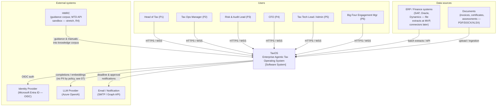
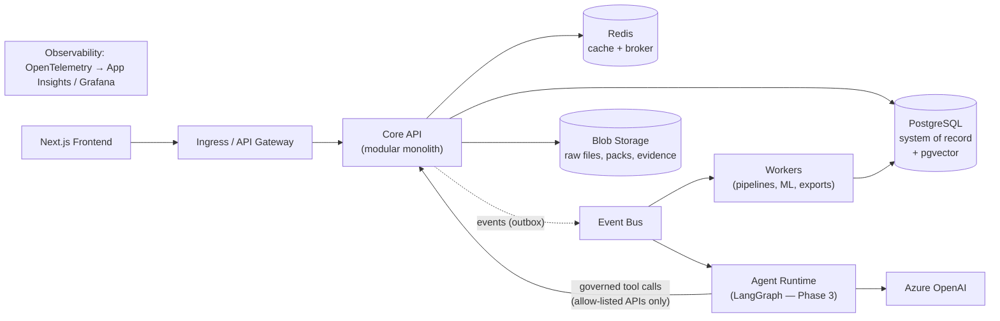

# 01 — Architecture Overview & System Context

## 1. Quality-attribute drivers

Architecture is shaped by the NFRs that are hardest to retrofit. Ranked drivers (from Phase 1):

| Rank | Driver | Source | Architectural consequence |
|---|---|---|---|
| 1 | **Auditability / evidence-by-default** | NFR-04, GP-2, AP-2 | Append-only audit chain, computation snapshots, lineage as first-class data — designed into the write path, not logged after the fact |
| 2 | **Correctness & reproducibility** | FR-205, AP-2 | Deterministic rule engine isolated from AI; versioned content packs; immutable computation records |
| 3 | **Governed autonomy** | FR-303, GP-1 | Approval gates are workflow states enforced server-side; agents physically cannot reach state-changing endpoints without the gate |
| 4 | **Tenant isolation** | FR-703, AP-5 | Tenant ID in every row from day one; RLS enforced at the database, not the application |
| 5 | **Scalability of batch + AI workloads** | NFR-06/09 | Async-first: heavy work behind queues; stateless services; LLM calls never on the request path |
| 6 | **Extensibility (jurisdictions, agents, models)** | AP-3, FR-206 | Plugin seams: content packs (data), agent registry (config), model registry (artifacts) |
| 7 | **Operability by a small team** | NFR-11/12 | Few deployable units, managed Azure services, one observability pipeline |

## 2. Architectural style decision (summary — full reasoning in ADR-001)

The master brief lists "microservices". The enterprise-correct reading of that requirement is *independently deployable, well-bounded services* — not maximal service count. TaxOS adopts a **modular monolith core with satellite services**:

- **Core API service** — a strictly modularised FastAPI application (domain modules with enforced boundaries) owning transactional business logic.
- **Agent Runtime service** — separate deployable for the LLM/agent workload (different scaling profile, dependency set, security blast radius — ADR-012).
- **Worker service** — Celery workers for pipelines, ML scoring, and exports (same codebase as core, different process/scale profile).
- **Frontend** — Next.js application.

This is the pattern Microsoft's own architecture guidance and Big Four internal platforms actually follow for systems at this stage: module boundaries first, service boundaries only where a distinct runtime concern (scaling, isolation, technology) justifies the distributed-systems tax. Every module boundary is service-extraction-ready (interfaces + events, no cross-module DB joins), so the path to finer-grained services is an operational decision, not a rewrite.

## 3. System context (C4 Level 1)

### Context boundaries worth stating explicitly

- **TaxOS never communicates outward autonomously.** The HMRC MTD arrow is a stretch goal and, even then, submission is human-triggered post-approval (GP-1/W-04). Notifications go only to configured internal recipients.
- **The LLM provider is outside the trust boundary.** Everything crossing that boundary is governed by the data-egress policy in doc 07 (pseudonymisation, no raw PII, tool allow-lists).
- **ERP systems are upstream-only.** TaxOS never writes back to the ERP; it is an analytical/compliance plane, which simplifies both security review and vendor conversations.

## 4. Architecture at a glance (the one-slide version)

Five deployable units, three stateful stores, one event backbone. Everything else in this documentation set is the disciplined elaboration of this picture.
