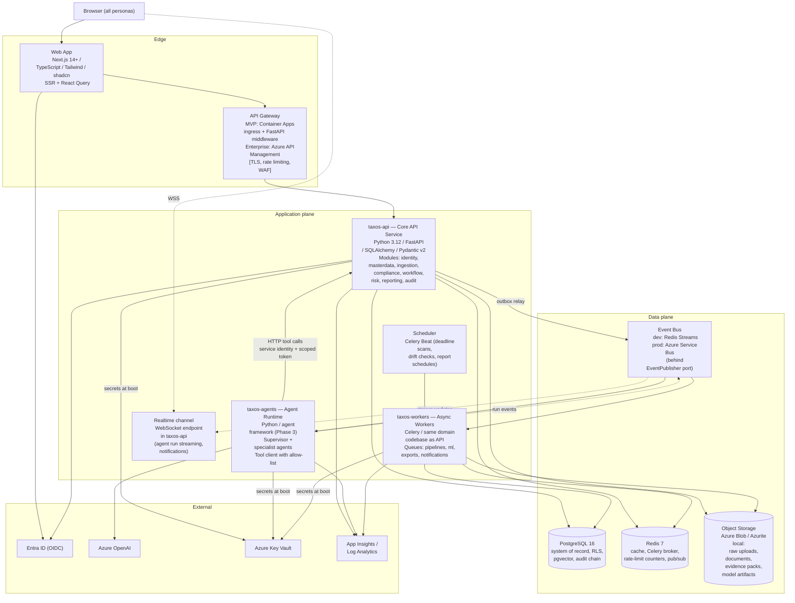

# 02 — Container Architecture (C4 Level 2)

## 1. Container diagram

## 2. Container responsibility matrix

| Container | Owns | Explicitly does NOT | Scale profile |
|---|---|---|---|
| **Web App (Next.js)** | Presentation, client state, optimistic UI, SSR for dashboards | Business rules, authorisation decisions (renders what API allows) | Horizontal, stateless, CDN-fronted |
| **API Gateway** | TLS termination, routing, rate limiting, request size limits, WAF (enterprise) | Business logic; auth beyond token validation passthrough | Managed |
| **taxos-api** | All transactional domain logic, authZ enforcement, workflow state machine, deterministic VAT engine, lineage, audit writes, WebSocket fan-out | LLM calls (zero LLM dependencies in this codebase — AP-2 enforced at dependency level), long-running work | Horizontal, stateless; p95 targets NFR-06 |
| **taxos-agents** | Agent graphs, prompts, LLM calls, agent memory access, tool invocation | Direct DB writes to business tables (forbidden — tools only), tax arithmetic | Horizontal; scale-to-zero when idle |
| **taxos-workers** | Ingestion pipelines, validation, ML scoring, evidence-pack rendering, notifications, outbox relay | Serving synchronous requests | Per-queue autoscale (KEDA on queue depth) |
| **Scheduler** | Cron-style triggers → enqueue tasks | Executing work itself | Singleton with leader election |
| **PostgreSQL** | System of record, RLS tenancy, vectors (MVP), audit chain | — | Vertical + read replica (enterprise) |
| **Redis** | Cache-aside, broker, rate counters, ephemeral pub/sub | Durable data (nothing in Redis is unrecoverable) | Managed (Azure Cache) |
| **Blob Storage** | Immutable raw files (WORM policy on evidence container), content packs, model artifacts | Queryable data | Managed |
| **Event Bus** | Durable domain events, consumer groups, DLQ | Request/response traffic | Managed |

## 3. Communication rules (enforced, not aspirational)

1. **Synchronous calls flow one direction:** FE → Gateway → API. The Agent Runtime calls the API only through the **Tool Gateway** endpoints (a dedicated, allow-listed API surface with its own service identity — ADR-012). No service ever calls the Agent Runtime synchronously; work reaches it via events.
2. **All cross-container writes are API-mediated.** Workers are the single exception (they share the domain layer as a library), and even they write through the same repository/audit code path — there is exactly one code path that mutates business state.
3. **Events are facts, not commands.** `BatchValidated`, `ComputationCompleted`, `AnomalyDetected`, `ApprovalGranted` — past-tense domain events. Command-style needs (e.g. "run this pipeline") use task queues, not the event bus. This keeps consumers decoupled and replayable.
4. **Everything idempotent.** Events carry `event_id`; consumers keep processed-ID watermarks; ingestion is content-hash deduplicated (US-201). At-least-once delivery is assumed everywhere.
5. **LLM traffic originates only from taxos-agents.** A dependency-check CI rule fails the build if `openai`/LLM SDKs appear in taxos-api or taxos-workers (AP-2 made mechanical).

## 4. Technology mapping & justification (summary)

| Concern | Choice | Alternatives considered | Why (full detail in ADRs) |
|---|---|---|---|
| API framework | FastAPI + Pydantic v2 | Django REST, Flask, Spring Boot | Type-safe contracts → OpenAPI for free; async-native; the de facto Python enterprise API standard; matches user's stack |
| ORM/migrations | SQLAlchemy 2 + Alembic | Django ORM, raw SQL | Unit-of-work pattern fits audit-on-write; Alembic gives reviewable, reversible schema history |
| System of record | PostgreSQL 16 | SQL Server, Cosmos DB, MySQL | RLS for tenancy, JSONB for snapshots, pgvector consolidates the MVP footprint — ADR-002 |
| Async tasks | Celery + Redis broker | Dramatiq, RQ, Azure Functions | Mature retry/routing/beat ecosystem; team familiarity; KEDA-scalable — see ADR-003 for the split between tasks and events |
| Event bus | Outbox → Redis Streams (dev) / Azure Service Bus (prod) | Kafka, RabbitMQ | Kafka is operational overkill at this scale; Service Bus is the Azure-native managed choice with DLQ/sessions — ADR-003 |
| Frontend | Next.js + shadcn/ui | Vite SPA, Remix | SSR for dashboard TTFB, ecosystem maturity, enterprise design-system fit (Phase 7) |
| Compute | Azure Container Apps | AKS, App Service | KEDA autoscaling + scale-to-zero + managed Dapr-style ops without cluster administration — ADR-008 |
| Observability | OpenTelemetry → App Insights | Datadog, ELK | Vendor-neutral instrumentation, Azure-native backend — doc 09 |
