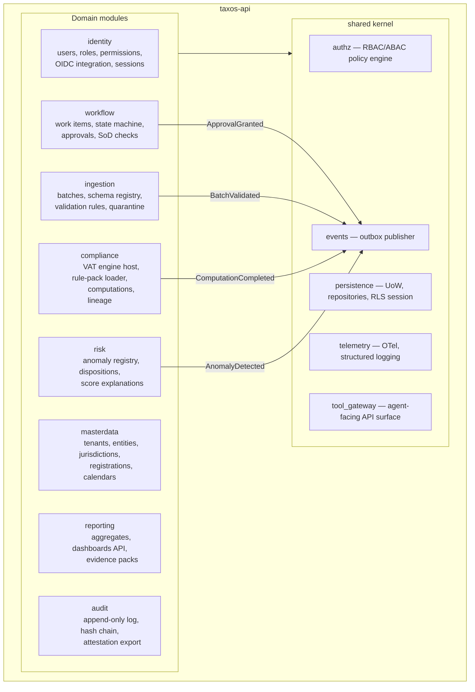
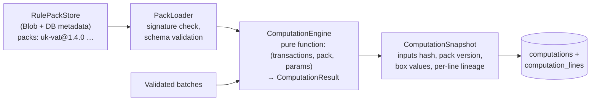
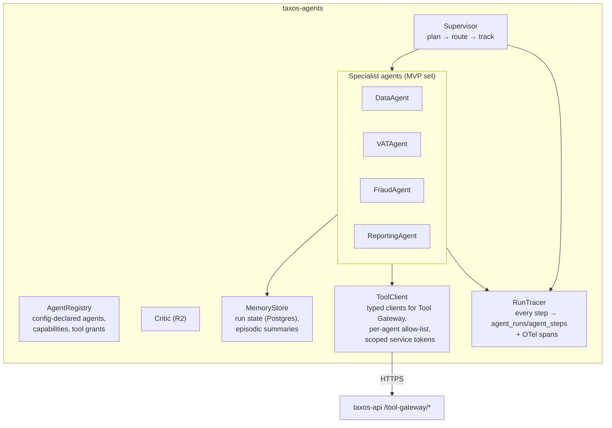

# 03 — Component Architecture (C4 Level 3)

## 1. taxos-api — module structure

The core service is a **modular monolith** with boundaries enforced by tooling (import-linter contracts in CI): modules may depend on `shared` and on other modules **only via their published service interfaces or domain events** — never on internals, never via cross-module table joins.



### Module contracts (what each publishes)

| Module | Service interface (sync) | Domain events (async) | Key invariants owned |
|---|---|---|---|
| identity | `AuthService`, `UserService` | `UserProvisioned`, `RoleChanged` | Every principal maps to roles + entity scopes; sessions carry tenant claim |
| masterdata | `EntityService`, `CalendarService` | `ObligationDue` (via scheduler scan) | Obligations derive from registrations + jurisdiction pack calendars |
| ingestion | `BatchService`, `ValidationService` | `BatchReceived`, `BatchValidated`, `RowsQuarantined` | No unvalidated row reaches computation; content-hash dedupe; batch immutable after validation |
| compliance | `ComputationService`, `RulePackService` | `ComputationCompleted` | Reproducibility (FR-205): computation = f(batch_ids, pack_version) recorded as snapshot; packs immutable once published |
| workflow | `WorkItemService`, `ApprovalService` | `WorkItemTransitioned`, `ApprovalGranted`, `EscalationRaised` | Legal state machine transitions only; SoD (preparer ≠ approver); approval binds to content hash |
| risk | `AnomalyService` | `AnomalyDetected`, `AnomalyDispositioned` | Every ML score stores model version + explanation payload; dispositions become labels |
| reporting | `DashboardService`, `EvidenceService` | `EvidencePackGenerated` | Aggregates rebuildable from source; packs assembled only from approved artifacts |
| audit | `AuditService` (write-only + query) | — | Append-only; hash chain continuity; called inside the same DB transaction as the mutation it records |

### The dependency rule

```
identity ← (all)          # everyone may check auth
masterdata ← ingestion, compliance, workflow, risk, reporting
ingestion ← compliance (read validated batches via interface)
compliance ← workflow (computation refs), reporting
risk ← reporting
audit ← (all, write-only)
NOTHING depends on reporting; reporting depends on read models only
```

Violations fail CI (`import-linter` contract file lives next to the code).

## 2. compliance module — the deterministic core (AP-2)



Engine properties, mechanically enforced:
- **Pure and side-effect free** — the engine is a library function; property-based tests (Hypothesis) assert determinism (same inputs ⇒ identical output hash).
- **Decimal arithmetic only** (`decimal.Decimal`, HMRC rounding rules encoded per pack) — floats are banned by lint rule in the compliance module.
- **Rule packs are data** (YAML/JSON: rate tables, box mappings, code classifications, effective dates + citation references to HMRC manual paragraphs), signed and immutable once published. Adding a jurisdiction = authoring a pack + calendar (AP-3). Pack schema is versioned independently of pack content.
- **No I/O inside the engine** — inputs are materialised before invocation, which is what makes snapshots complete and replay trivial.

## 3. taxos-agents — component view

Framework-agnostic seams now; framework selection is Phase 3 (ADR-013 reserved).



Two boundaries do the governance work:
1. **ToolClient allow-list** — an agent's tool grants are declared in the registry config; the ToolClient refuses undeclared calls *and* the Tool Gateway independently verifies the grant server-side (defence in depth). The VATAgent can call `get_validated_batch`, `run_vat_computation`, `create_work_item` — it has no tool that files, emails, or approves. Approval endpoints are not exposed on the Tool Gateway at all.
2. **RunTracer** — steps are recorded before/after every LLM and tool call (FR-302); a run that cannot trace cannot proceed (tracing is not best-effort).

## 4. taxos-workers — pipeline components

| Queue | Components | Trigger |
|---|---|---|
| `pipelines` | `BatchValidator` (schema registry → rule checks → quarantine writer), `LineageIndexer` | `BatchReceived` event / upload task |
| `ml` | `AnomalyScanner` (rules + IsolationForest at MVP), `ScoreExplainer` (SHAP, R2), `DriftMonitor` (R2) | `BatchValidated`, schedule |
| `exports` | `EvidencePackBuilder` (collect approved computation + lineage + approvals + agent traces → PDF/ZIP → Blob), `ReportRenderer` (R3) | user request task |
| `notifications` | `DeadlineScanner` (RAG transitions per US-302), `Notifier` (email/in-app) | Celery Beat schedule, workflow events |
| `outbox` | `OutboxRelay` (poll outbox table → publish to bus, exactly-once via row locking) | continuous |

Workers import the same domain layer as taxos-api — one implementation of validation, lineage, and audit writes (communication rule #2, doc 02).
