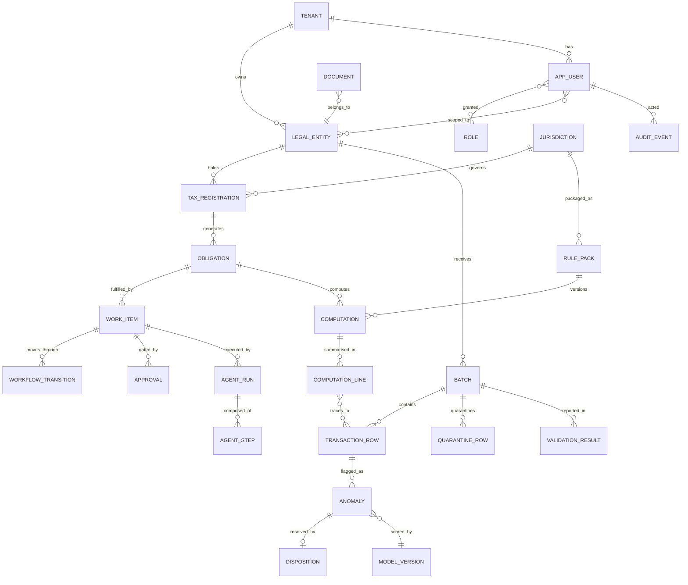

# 04 — Data Architecture

## 1. Design principles

1. **One system of record** (PostgreSQL — ADR-002); everything else (Redis, Blob-derived artifacts, aggregates) is rebuildable.
2. **Tenant column everywhere** + RLS (ADR-006): `tenant_id` is NOT NULL on every business table from migration 0001, even while the product runs single-tenant (AP-5, cheap now / impossible later).
3. **Immutability where evidence lives:** batches after validation, computations, rule packs, approvals, audit log — updated never, superseded by new versions with lineage links.
4. **Lineage is data, not documentation:** computed figures link to contributing rows via association tables, enabling US-202's "sum of contributions equals the figure exactly" test.
5. **Time is bitemporal where it matters:** rule packs and registrations carry `effective_from/to` (tax law time) separately from `created_at` (system time).

## 2. Logical data model (core ERD)



## 3. Table design highlights (the decisions that matter)

| Table / concern | Design | Rationale |
|---|---|---|
| `transaction_row` | Range-partitioned by `(tenant_id, period)`; typed columns for tax-relevant fields + `source_payload JSONB` for the raw row; `batch_id`, `row_hash` | Partition pruning for period-scoped queries (NFR-06: 1M rows/hr); raw payload preserves evidence without schema churn |
| `computation` | `inputs_hash` (hash of sorted contributing row-hashes + params), `pack_version`, `result JSONB` (box values), `status`; UNIQUE `(obligation_id, inputs_hash, pack_version)` | Reproducibility is testable: recompute ⇒ same `inputs_hash` must yield identical `result`; the unique constraint makes accidental duplicate computations impossible |
| `computation_line` ↔ `transaction_row` | Association table `computation_line_source (line_id, row_id, amount_contribution)` | The lineage drill-down (US-202) is a join, not a log-dig; contribution amounts must sum exactly to the line |
| `approval` | Stores `subject_type/subject_id`, `content_hash` of the approved artifact, approver, timestamp, comment; **no UPDATE grant** | Approval binds to *content*, not to an ID whose content might change (US-402: input change voids approval by hash mismatch) |
| `audit_event` | `id BIGSERIAL`, `prev_hash`, `event_hash = H(prev_hash ‖ payload)`, actor (user or agent+run), before/after refs; append-only (REVOKE UPDATE/DELETE; trigger guard) | Tamper-evident chain (ADR-009); written in the same transaction as the mutation — an unaudited mutation cannot commit |
| `rule_pack` | Metadata row + content in Blob, `content_sha256`, `status(draft/published/retired)`, `effective_from/to`, `schema_version` | Packs as signed artifacts (AP-3); DB holds the index, Blob holds the immutable content |
| `outbox_event` | `event_id UUID`, `aggregate`, `type`, `payload JSONB`, `published_at NULL` | Transactional outbox (ADR-003): event row commits atomically with the state change |
| `agent_run` / `agent_step` | Run: work_item ref, plan, status, cost totals. Step: agent, model, prompt/tool refs (large payloads → Blob pointer), tokens, latency, output hash | FR-302 full replayability without bloating Postgres — payload bodies over ~8KB go to Blob |
| `anomaly` | `detector` (rule id or model), `model_version_id`, `score`, `explanation JSONB` (SHAP values R2), `status`, disposition link | Explainability stored at scoring time — you cannot re-derive a SHAP value later if the model moved (FR-502) |
| `knowledge_chunk` (R2) | `source_uri`, `citation_ref` (doc/section/para), `embedding VECTOR`, jurisdiction/tax/date metadata columns | Hybrid search = pgvector ANN + Postgres FTS + metadata WHERE — one engine at MVP scale (ADR-002) |

## 4. Caching strategy (ADR-011)

| Layer | What | Pattern | TTL / invalidation |
|---|---|---|---|
| L1 — HTTP | Dashboard GETs | `ETag`/`Cache-Control: private` | Short (30s) — freshness beats chatter |
| L2 — Redis | Session/authz context (roles, entity scopes), jurisdiction/pack metadata, dashboard aggregates | Cache-aside with namespaced keys `t:{tenant}:agg:{name}:{period}` | Event-driven invalidation: consumers of `ComputationCompleted`/`ApprovalGranted` delete affected keys; TTL backstop 15 min |
| L3 — Postgres | Reporting aggregates (`rpt_*` tables) | Incrementally refreshed by worker on domain events (not `MATERIALIZED VIEW REFRESH` — too coarse) | Rebuildable from source at any time |

Rules: cache only derived/read data (never workflow state or approvals — correctness beats latency on the write path); every cached object carries tenant in its key (no cross-tenant cache bleed); rate-limit counters and Celery state live in separate Redis logical DBs from cache (blast-radius separation).

## 5. Object storage layout

```
blob://
  raw/{tenant}/{batch_id}/original.csv          # WORM: as-uploaded evidence
  documents/{tenant}/{doc_id}/...               # invoices, certificates (+ OCR sidecar)
  packs/{jurisdiction}/{pack}@{version}.tar.gz  # signed rule packs (global, not tenant)
  evidence/{tenant}/{work_item_id}/pack.zip     # generated evidence packs — WORM, legal hold capable
  agent-payloads/{tenant}/{run_id}/{step}.json  # large prompts/outputs
  models/{name}/{version}/artifact.pkl          # ML registry storage (R2: MLflow-managed)
```

Evidence and raw containers use Azure immutability policies (time-based retention) — deletion-proof even for admins within the retention window (NFR-04, GDPR carve-outs handled via pseudonymisation at ingest rather than deletion of evidence, detailed in Phase 9).

## 6. Retention & GDPR posture (architecture-level)

- Business/tax records: statutory retention (UK: 6 years + current) — retention clock per record class in masterdata config.
- PII minimisation at the edge: payroll/personal identifiers pseudonymised during ingestion (deterministic keyed hashing; key in Key Vault) so downstream stores and *especially* LLM-bound context operate on pseudonyms (NFR-03).
- Right-to-erasure: erase the pseudonymisation mapping, not the evidence — the record survives, the person is unlinkable. This is the standard reconciliation of GDPR with statutory tax retention.

## 7. Scale path (stated now, exercised later)

| Pressure | First response | Second response |
|---|---|---|
| Transaction volume | Partitioning (in place day one) + partition-wise batch processing | Move cold partitions to cheap storage; columnar replica for analytics |
| Read load on dashboards | L2/L3 caches (in place) | Postgres read replica for `rpt_*` |
| Vector corpus growth | pgvector HNSW index | Azure AI Search (enterprise tier) behind the same retrieval interface — a swap, not a rewrite |
| Tenant count | RLS shared schema | Premium tier: database-per-tenant using the same migrations (ADR-006 keeps both doors open) |
