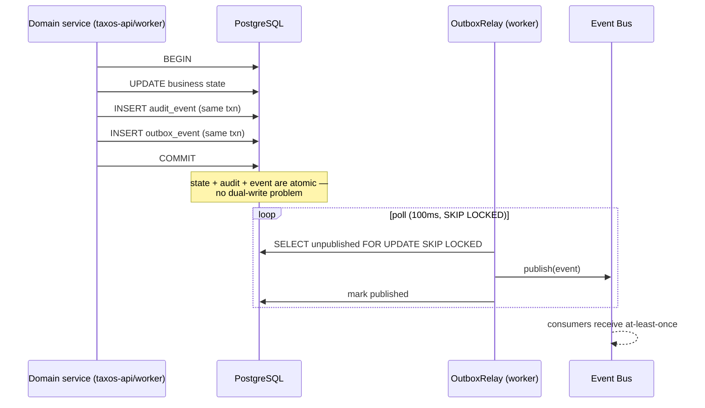

# 05 — Eventing & Asynchronous Processing

## 1. The two async channels (and why they're separate)

A common enterprise failure mode is one bus doing two jobs. TaxOS separates them explicitly (ADR-003):

| Channel | Semantics | Technology | Used for |
|---|---|---|---|
| **Task queue** | *Commands*: "do this work", exactly-one-worker, retries with backoff, priority | Celery over Redis | Validation pipelines, ML scans, exports, notifications |
| **Event bus** | *Facts*: "this happened", fan-out to N independent consumers, replayable, durable | Outbox → Redis Streams (dev) / Azure Service Bus topics (prod) | Domain events driving agents, cache invalidation, projections, WebSocket updates |

Rule of thumb enforced in review: if removing the consumer would make the producer incorrect, it's a task; if the producer shouldn't know the consumer exists, it's an event.

## 2. Reliable publication: transactional outbox

Why not publish directly to the bus in-process? Because a crash between DB commit and publish silently loses events (or worse, publishes events for rolled-back transactions). The outbox makes state change and event emission atomic — the standard pattern (Microsoft eShop reference architecture, Debezium-style CDC being the heavier alternative rejected for ops cost).

**Consumer contract:** at-least-once + idempotent handlers (processed `event_id` watermark table per consumer group); poison messages → DLQ after N attempts with alerting; DLQ replay is a runbook operation, never automatic.

## 3. Event catalogue (MVP)

| Event | Producer | Payload core | Consumers |
|---|---|---|---|
| `BatchReceived` | ingestion | batch_id, entity, period, row_count, content_hash | workers.pipelines (validate) |
| `BatchValidated` | workers | batch_id, stats, exception_count | workers.ml (anomaly scan), agents (resume waiting plan), WS |
| `RowsQuarantined` | workers | batch_id, rule breakdown | notifications, WS |
| `ComputationCompleted` | compliance | computation_id, obligation, inputs_hash, pack_version | cache invalidator, reporting projector, agents, WS |
| `AnomalyDetected` | workers.ml | anomaly_ids, severity histogram | notifications, WS, reporting projector |
| `AnomalyDispositioned` | risk | anomaly_id, disposition, actor | ML label store, reporting projector |
| `WorkItemTransitioned` | workflow | work_item_id, from→to, actor | WS, notifications, reporting projector |
| `ApprovalGranted` / `ApprovalVoided` | workflow | subject, content_hash, approver | evidence builder eligibility, cache invalidator, WS |
| `EscalationRaised` | agents (via Tool Gateway) | run_id, reason, needed_input | notifications, WS |
| `AgentRunStateChanged` | agents | run_id, status, step summary | WS (live run view), cost monitor |

Schema governance: events are versioned Pydantic models in a shared `contracts` package; breaking changes require a new event version published alongside the old during a deprecation window (same discipline as the REST API, doc 06).

## 4. Task scheduling

| Schedule | Task | Notes |
|---|---|---|
| hourly | `deadline_scan` | Obligation RAG transitions (US-302) → notifications; idempotent by design |
| daily 02:00 | `reporting_rebuild_check` | Verify aggregates vs source counts; heal drift |
| daily | `model_drift_check` (R2) | PSI/KS stats on scoring inputs vs training baseline |
| weekly | `pack_update_check` (R3) | Regulatory monitoring trigger |
| cron per tenant (R3) | `board_pack_generate` | Enters approval workflow, never auto-distributes |

Celery Beat runs as a single replica with a Redis lock (leader election) — a duplicated beat firing double tasks is the classic failure; tasks are also idempotent as the second defence.

## 5. WebSockets (real-time UX without polling)

- Endpoint: `wss://.../ws` in taxos-api; authenticated via the same JWT (token in subprotocol header, re-validated on connect; connection dropped on token expiry).
- Server-side: WS handler subscribes to Redis pub/sub channels bridged from the event bus (`ws:{tenant}:{topic}`); events are filtered by the connection's tenant + entity scope **server-side** before emission — authorisation applies to pushed data exactly as to pulled data.
- Topics: agent run streams (live plan/step updates in the workspace), workflow transitions, anomaly arrivals, notification badges.
- Degradation: if WS is unavailable the frontend falls back to React Query polling (30s) — real-time is an enhancement, not a correctness dependency (NFR-05 graceful degradation).
- Scale: WS connections are sticky to a replica but state-free (all state in Redis/Postgres), so replicas can drain and connections re-establish anywhere.

## 6. Backpressure & flow control

- Queue-depth autoscaling (KEDA) per Celery queue with per-queue concurrency caps — an ingestion storm cannot starve notification delivery (separate queues, separate workers).
- LLM calls in taxos-agents run through a token-bucket limiter + circuit breaker per provider deployment; on open circuit, runs park in `WAITING_PROVIDER` rather than failing (NFR-05).
- Ingestion applies per-tenant concurrent-batch limits (fairness in multi-tenant mode).
