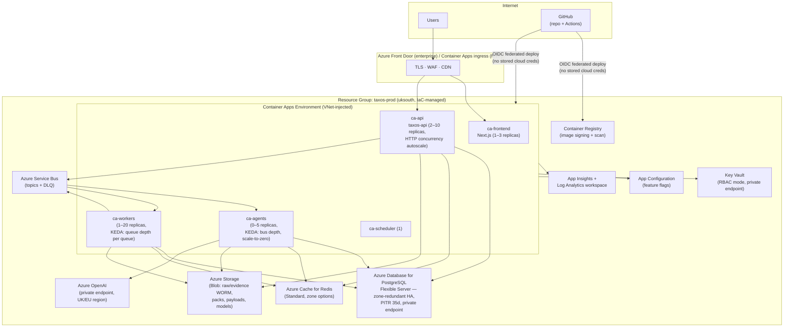

# 08 — Deployment & Cloud Architecture

## 1. Azure deployment diagram (production)



All data services sit behind **private endpoints** inside the VNet; the only public surfaces are the frontend/API ingress. Region: `uksouth` primary (UK data residency, NFR-03), `ukwest` for DR assets.

## 2. Environments

| Env | Purpose | Infra | Data |
|---|---|---|---|
| `local` | Dev inner loop | docker compose: Postgres, Redis, Azurite, dev-issuer, all services with hot reload | Seeded synthetic dataset (checked-in generator, not checked-in data) |
| `ci` | Ephemeral per-pipeline | compose services in GitHub Actions | Fixtures + synthetic |
| `staging` | Pre-prod, demo | Scaled-down mirror of prod (same IaC modules, smaller SKUs, scale-to-zero aggressive) | Synthetic demo tenant(s) |
| `prod` | Live / portfolio demo | Diagram above | Real or realistic-synthetic |

One Terraform root per environment consuming shared modules; environment differences are variable files, not divergent code.

## 3. CI/CD (GitHub Actions)

```
PR pipeline (required checks):
  lint (ruff, eslint) · type (mypy strict, tsc) · unit tests + coverage gate (85% core)
  contract lint (spectral) + schemathesis smoke · import-linter module contracts
  LLM-dependency guard (AP-2 check, doc 02 §3.5) · gitleaks · trivy (deps + image)
  build images (no push)

main pipeline:
  all of the above → push signed images to ACR (tag = git SHA)
  → terraform plan (staging) → apply → alembic migrations (gated job)
  → deploy staging → smoke suite + eval harness (R2+) against staging
  → manual approval gate (GitHub environment protection)
  → deploy prod via Container Apps *revisions*: new revision at 0% traffic
    → health checks pass → shift 100% (or canary 10→100 enterprise)
    → previous revision retained for instant rollback

nightly:
  full integration suite · load smoke (k6, budget-capped) · dependency audit
  · audit-chain integrity verification on staging
```

Deployment principles: images immutable and signed (cosign); config injected at runtime from App Configuration + Key Vault (12-factor); **migrations are expand→migrate→contract** (backwards-compatible for one revision overlap, so rollback never fights the schema); rollback = revision traffic flip + (if needed) contract-phase deferral.

## 4. High availability

| Tier | Mechanism | Target |
|---|---|---|
| API/frontend | Multi-replica across zones, revision-based deploys, health probes (liveness/readiness/startup) | 99.9% (NFR-05) |
| Postgres | Zone-redundant HA (synchronous standby, automatic failover) | RPO 0 within region |
| Redis | Cache: loss-tolerant by design (rebuildable); broker: Standard-tier replication; tasks idempotent + re-enqueueable | Degraded-mode tolerant |
| Service Bus | Premium zone redundancy (enterprise); outbox retains unpublished events through outages | No event loss (outbox) |
| LLM dependency | Circuit breaker → runs park, work queues persist; platform fully usable for non-agent operations during provider outage | Graceful degradation |

## 5. Disaster recovery (NFR-14: RPO ≤ 1h, RTO ≤ 4h)

- **Postgres:** PITR (35 days) + geo-redundant backups to `ukwest`; documented restore runbook, rehearsed and timed (evidence in Phase 10).
- **Blob:** RA-GRS replication; WORM/immutability replicates with the account.
- **Everything else is rebuildable:** infra from Terraform, images from ACR (geo-replicated), Redis warm-up from source, Service Bus re-fed by outbox relay.
- **DR strategy: pilot-light** — IaC + backups standing by in `ukwest`; a scripted `dr-restore` pipeline builds the environment and restores data. Active-active was rejected: doubles cost for a compliance platform whose RTO tolerance is hours, not seconds (trade-off recorded in ADR-008 consequences).
- Quarterly restore rehearsal is a runbook item with a logged timing result — a DR plan that hasn't restored is a hope, not a plan.

## 6. Feature flags & progressive delivery

- **Azure App Configuration** feature manager, accessed via the OpenFeature SDK (vendor-neutral seam — swappable to LaunchDarkly/Unleash without code churn).
- Flag classes: *release* flags (dark-launch incomplete features — e.g. `ff_ct_engine`), *ops* flags (kill switches: `ff_agent_runs_enabled`, `ff_llm_provider_fallback`), *tenant entitlement* flags (edition tiering, per-tenant limits — doc 06 §5).
- Rules: flags default-off; every flag has an owner + removal ticket (flag debt is tech debt); kill switches tested in staging chaos drills; flag evaluations logged into telemetry so incident timelines show flag flips.

## 7. Cost posture (portfolio-honest)

Scale-to-zero on agents/workers in staging; Container Apps consumption plan; Postgres burstable SKU outside demo windows; budget alerts at resource-group level; nightly teardown option (`terraform destroy` + scripted re-seed ≤ 30 min) documented for long idle periods. Estimated steady demo cost: low tens of £/month idle, capped double digits during active demos — the architecture demonstrates enterprise patterns without enterprise burn.
