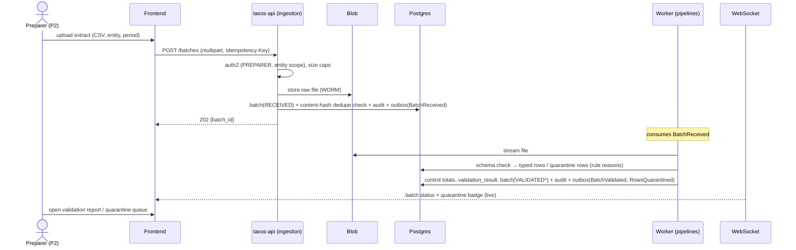
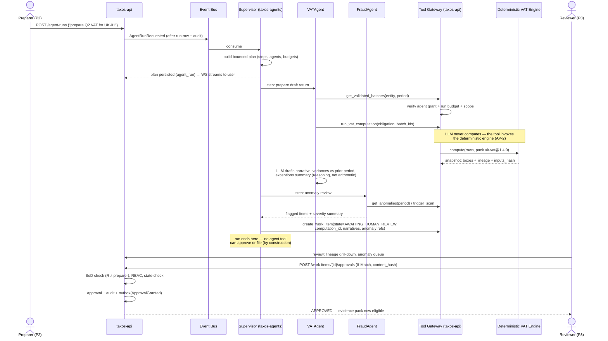
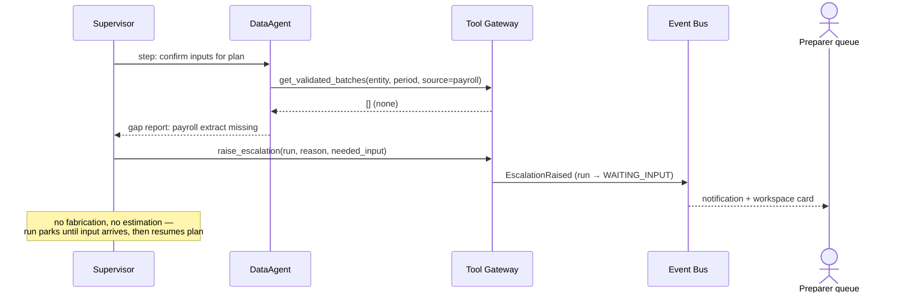
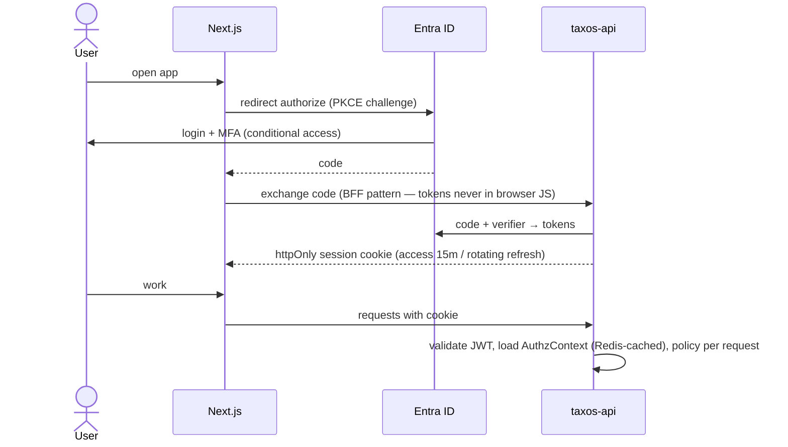
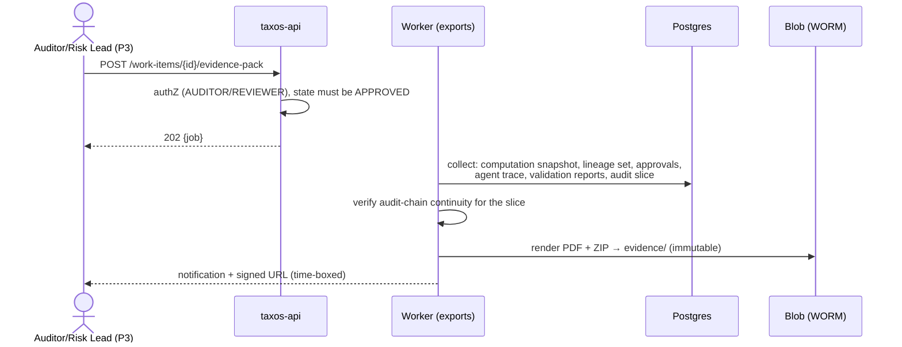
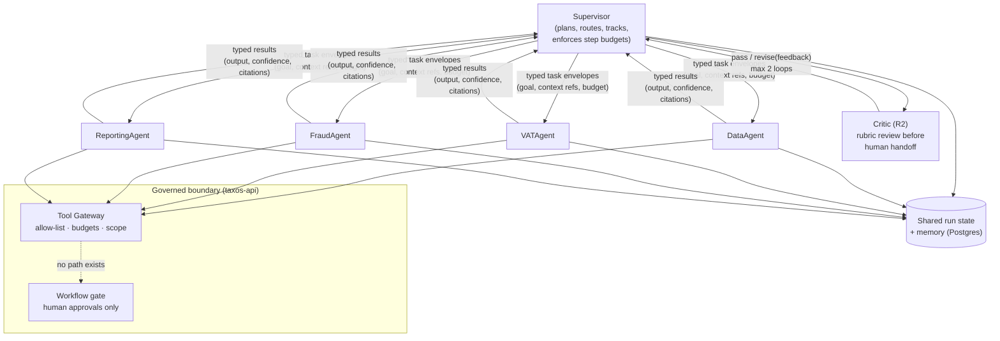

# 10 — Sequence Diagrams & Agent Communication Flow

## 1. Batch ingestion & validation (US-201)

## 2. Agent-orchestrated VAT cycle with approval gate (US-401/402) — the flagship flow

## 3. Escalation path (US-401 missing-data scenario, FR-306)

## 4. Authentication (OIDC + PKCE)

## 5. Evidence pack export (US-603/US-202)

## 6. Agent communication model (structural view)

Communication rules: agents never message each other directly — all coordination flows through the Supervisor via **typed envelopes** (goal, input refs, budget, deadline) and typed results (output, confidence, citations, cost). This makes every hop traceable (FR-302), budget-enforceable, and framework-portable (the envelope contract survives a Phase 3 framework swap — ADR-012). Peer-to-peer agent chatter was rejected: it's untraceable, unbudgetable, and adds no capability a supervisor route lacks.
