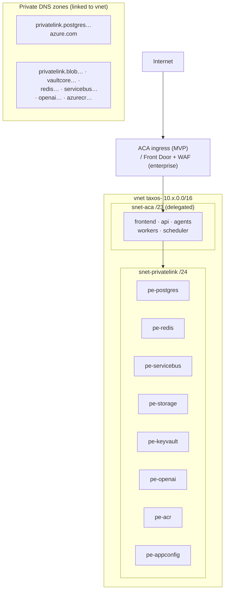

# 02 — Network & Identity

## 1. Network topology (per environment)

- **Only ingress is public** (frontend + API routes via ACA ingress; enterprise adds Front Door + WAF policies in front). Every data/AI service: `public_network_access = Disabled` + private endpoint + private DNS — enforced by policy (doc 01 §4), not convention.
- NSGs: `snet-aca` egress allow-list (privatelink subnet, DNS, HTTPS to IdP + GitHub OIDC endpoints); default-deny inbound on privatelink subnet except from `snet-aca`.
- Egress note (honest limitation): ACA consumption without NAT gateway has dynamic egress IPs; enterprise tier adds NAT gateway + UDR for fixed-egress requirements (some ERP allow-lists demand it) — costed as an option in doc 05.
- No VPN/bastion at MVP (nothing to shell into — everything is managed); `az containerapp exec` (RBAC-gated, audited in activity log) is the break-glass console.

## 2. Identity model — zero stored cloud credentials

| Principal | Type | Grants (least privilege) |
|---|---|---|
| `id-taxos-api` | ACA system-assigned MI | KV secrets get (its own scope), Blob (raw/evidence/packs containers RW per role assignment), Service Bus send, App Config read |
| `id-taxos-workers` | MI | KV get, Blob RW, Service Bus send+receive, (via DB creds from KV: worker DB role) |
| `id-taxos-agents` | MI | KV get (agent-scope secrets only), Service Bus receive, AOAI `Cognitive Services OpenAI User`, Blob (agent-payloads only) — **no business-container access** (ADR-012 at the IAM layer) |
| `id-taxos-frontend` | MI | App Config read only |
| GitHub Actions | **OIDC federated credential** per environment (subject-scoped to repo+env: `repo:…:environment:prod`) | staging: Contributor on RG; prod: custom role (deploy-only: ACR push, ACA update, TF state access) — no long-lived SP secrets anywhere |
| Humans | Entra groups (`taxos-platform-admins`, `taxos-readers`) via PIM (just-in-time elevation, enterprise) | Portal read by default; write via PIM activation, logged |

Postgres uses distinct DB roles (app/migration/platform — Phase 6 doc 03) with passwords generated by TF into Key Vault and rotated by pipeline schedule; Entra-integrated Postgres auth is the documented upgrade (deferred: SQLAlchemy async + token refresh plumbing adds complexity that password-in-KV + rotation covers at this scale — trade-off recorded, revisit with enterprise tier).

## 3. Secret flow (runtime)

App boot → MI token → Key Vault references resolved into env (ACA secret refs) → `pydantic-settings` reads env (Phase 6 doc 02 §3). Rotation = new KV version + ACA revision restart (pipeline-automated, staged staging→prod). **No secret ever exists in:** code, TF state (where avoidable — see doc 01 §3), pipeline logs (masked + OIDC means few secrets exist at all), or container images (scanned in CI to prove it).
