# 01 — Corpus & Ingestion

## 1. Source taxonomy & authority ranking

Authority ranking is first-class metadata — the Research agent presents conflicts by rank, never resolves them (docs/ai/04 §4.2).

| Rank | Class | Sources (UK anchor) | Update cadence | Format reality |
|---|---|---|---|---|
| A1 | Primary legislation | VATA 1994, CTA 2009/2010, TMA 1970, annual **Finance Acts** (legislation.gov.uk) | Per Finance Act + amendments | XML (structured, blessed) |
| A2 | Secondary legislation & case law | SIs, tribunal/court decisions (selected) | Continuous | XML/HTML/PDF |
| A3 | HMRC guidance | **HMRC manuals** (VAT: VATSC/VIT/VATP…, CT, international), notices, briefs | Weekly-ish page updates | HTML (gov.uk, structured) |
| A4 | International frameworks | **OECD** MTC + commentary, TP Guidelines, Pillar Two model rules; **IFRS/IAS** standards relevant to tax (IAS 12, IFRIC 23) | Periodic | PDF (licensing-aware: some IFRS content is summarised-with-pointer, not stored — flagged `license_restricted`) |
| B1 | Internal policy | Tenant tax policies, TP policies, group manuals | Tenant-managed | DOCX/PDF |
| B2 | Corporate documents | Structures, IC agreements, prior filings, advisor memos | Tenant-managed | PDF/DOCX/XLSX |
| B3 | Working knowledge | Curated **emails**, **SharePoint** libraries (tenant-connected) | Continuous | MSG/EML, mixed |

Class A is **global corpus** (shared, one ingestion serves all tenants); class B is **tenant corpus** (RLS-isolated like all tenant data). Retrieval always searches both with tenant scoping; authority rank breaks ties *presentationally*, never by hiding lower ranks.

## 2. Temporal validity (the tax-specific hard part)

Tax questions are always "as of when" questions. Every corpus item carries:

- `valid_from` / `valid_to` — the period the content correctly describes (for legislation: version effective window from legislation.gov.uk point-in-time data; for manuals: page-version window from update history).
- `published_at` — when the source published it; `ingested_at` — system time.
- Supersession links: `superseded_by` chains preserve every historical version — a 2024 enquiry needs 2024 guidance, so **nothing is deleted on update**, it is end-dated.

Retrieval defaults to `as_of = today` but accepts any date (Research agent I/O includes `as_of_date`); the compliance calendar drives period-correct defaults when a question arises from a work item.

## 3. Ingestion pipelines

```mermaid
flowchart LR
    subgraph Fetch["Acquisition (per-source adapters, scheduled)"]
        GOV["gov.uk / legislation.gov.uk
        API + structured scrape"]
        OECD["OECD/IFRS
        managed downloads"]
        SPC["SharePoint connector
        (Graph API, R3)"]
        EMLC["Email intake
        (dedicated mailbox, R3)"]
        UPL["Manual upload (UI)"]
    end
    Fetch --> STG["Staging store
    raw + fetch manifest
    (hash, source, timestamp)"]
    STG --> NORM["Normalisation
    format → canonical doc model
    (sections, headings, paras, tables)"]
    NORM --> SCAN["Safety & quality gates
    malware scan · PII detection (B-class)
    · injection-pattern screening
    · dedupe (content hash)"]
    SCAN --> REVIEW{"Curation gate"}
    REVIEW -->|"A-class: auto-approve on
    trusted-source allow-list + diff report"| CHUNK
    REVIEW -->|"B-class: human curator
    approves scope + classification"| CHUNK["Chunking + embedding
    (doc 02)"]
    CHUNK --> IDX[("Corpus store
    knowledge_doc / knowledge_chunk
    + FTS + vectors")]
    IDX --> EVENT["KnowledgeUpdated event
    → Regulatory Monitor (R3)
    → eval-set impact check"]
```

Pipeline properties:
- **Adapters are per-source and versioned** — gov.uk markup changes break an adapter, not the corpus; fetch manifests make every ingest reproducible.
- **Injection screening on everything** (A and B): retrieved text reaches prompts, so ingestion is a trust boundary (doc 07 §3). Screening flags instruction-like patterns, embedded prompts, anomalous unicode; flagged content requires curator override with justification (logged).
- **PII gate on B-class**: emails/corporate docs pass the pseudonymisation pipeline before indexing (doc 04 §6) — personal data does not enter the corpus in raw form.
- **Diff-on-update for A-class**: a manual page update produces a structural diff artifact; that diff is what the Regulatory Monitor consumes (FR-404) and what triggers pack-citation drift checks (`get_pack_citations` reverse index, docs/ai/04 §4.5).
- **Email/SharePoint are curated, not vacuumed** (R3): the connector ingests from designated libraries/mailbox folders only — deliberate curation over bulk-crawl, because corpus quality *is* answer quality, and bulk email is a liability, not knowledge.

## 4. Corpus governance

| Control | Mechanism |
|---|---|
| Provenance | Every doc: source URI, fetch manifest, adapter version, curator identity (B-class), full version chain |
| Change review | A-class auto-ingest publishes a daily digest of diffs to P5/P3; B-class requires explicit curator approval |
| Licensing | `license_class` metadata; restricted content (some IFRS) stored as summary + authoritative pointer; retrieval marks these so citations point outward |
| Quality feedback | Research-agent insufficiency verdicts and reviewer flags create corpus-gap tickets (docs/ai/04 §4.2 escalation) — the corpus has a backlog like any product |
| Deletion | End-dating only (§2); true deletion only for legal/PII removal via governed exception with audit trail |
| Injection quarantine | Screening hits quarantined pending curator decision; overrides logged with justification |

## 5. Corpus scope at each release

| Release | Corpus milestone |
|---|---|
| R1 | No RAG (agents cite pack rules only — which already carry HMRC references via ADR-005) |
| R2 | Global A-class UK VAT+CT core: key manuals (VIT, VATSC, VAT notices, CT manuals), VATA/CTA extracts, ~10–20k chunks; golden `research-qa` set built against it |
| R3 | Regulatory-diff pipeline live (Monitor agent); tenant B-class via upload + curation UI; SharePoint/email connectors |
| R4 | OECD/IFRS layer, knowledge-graph enrichment (doc 04), multi-jurisdiction schema exercised with a second jurisdiction sample pack |
