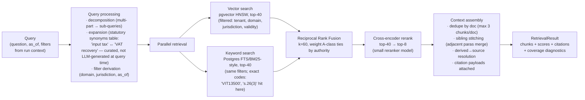

# 03 — Retrieval

## 1. Query pipeline



## 2. Design decisions (ADR-015 summary)

| Decision | Choice | Rejected alternative & why |
|---|---|---|
| Fusion | **RRF (k=60)** over score normalisation | Normalising cosine vs FTS rank scores is fragile across corpus growth; RRF is rank-based, parameter-light, and the industry default for exactly this reason |
| Reranking | **Cross-encoder over top-40** (managed reranker or small fine-tunable model behind a `Reranker` port) | LLM-as-reranker: 10× cost/latency for marginal gain at our k; no reranker at all: hybrid recall without precision measurably fails the ≥95% citation-support bar on dry-run evals |
| Keyword side | Postgres FTS with `websearch_to_tsquery` + trigram index for code lookups | External Elasticsearch: another stateful service duplicating what FTS covers at this scale (consistent with ADR-002 consolidation) |
| Query expansion | **Curated synonym table** (statutory ↔ colloquial terms, maintained with the corpus) | LLM query rewriting at runtime: non-deterministic retrieval (same question, different chunks on different days) breaks eval reproducibility and reviewer trust; LLM-assisted synonym *authoring* offline is fine |
| Multi-hop | Agent-side iterative retrieval (Research agent decomposes, retrieves per sub-question, synthesises) | Automatic graph-walk retrieval deferred with the knowledge graph (doc 04) |

## 3. Retrieval contract (the `Retriever` port)

```python
class RetrievalQuery(BaseModel):
    text: str
    filters: RetrievalFilters        # tenant scope, jurisdiction, tax_domain, as_of, authority ranks
    top_k: int = 8
    diagnostics: bool = True

class RetrievalResult(BaseModel):
    chunks: list[RetrievedChunk]     # text_raw, enriched text, citation payload, scores (vector/keyword/fused/rerank)
    coverage: CoverageDiagnostics    # best-score bands, filter narrowing applied, corpus segments searched
    index_generation: str            # reproducibility: which index answered
```

`CoverageDiagnostics` exists for the **insufficiency verdict** (FR-403): the Research agent's INSUFFICIENT_SOURCES output cites what was searched and how weak the best matches were — "no answer" is an evidenced claim like any other. Implementations: `PgVectorRetriever` (MVP), `AzureAISearchRetriever` (enterprise swap, same contract, same eval suite).

## 4. Multi-tenancy & security in retrieval

- Tenant filter is applied **inside the store query** (RLS + explicit predicate — belt and braces), never post-filtering in application code.
- Global A-class corpus is read-only to all tenants; B-class never crosses tenants; cache keys (if retrieval caching is ever enabled) include full filter fingerprint — currently retrieval is **uncached** (corpus updates must be immediately visible; latency budget doesn't require it).
- Retrieved text is untrusted input to prompts: delimited and tagged at context assembly (doc 07 §3); the injection screen at ingestion (doc 01 §3) is the first gate, prompt isolation the second, output invariants the third.

## 5. Latency & quality budgets

| Stage | Budget (p95) |
|---|---|
| Query processing | 50 ms (synonym table lookup, no LLM) |
| Parallel vector + keyword | 150 ms |
| RRF + rerank (top-40) | 400 ms (reranker dominates) |
| Assembly | 50 ms |
| **End-to-end `search_knowledge`** | **< 700 ms** |

Quality (gated in CI against `research-qa`, per doc/ai/05):
- Recall@40 (pre-rerank) ≥ 97% — fusion must not lose gold chunks before reranking.
- nDCG@8 (post-rerank) ≥ 0.85.
- Gold-chunk-in-context rate ≥ 95% (the retrieval share of NFR-07's citation-support target).
- Insufficiency detection: coverage diagnostics must separate answerable from unanswerable golden questions with ≥95% accuracy at the tuned threshold.

## 6. Failure modes & responses

| Failure | Response |
|---|---|
| Vector index unavailable | Degrade to keyword-only with `degraded: true` in diagnostics — Research agent lowers confidence accordingly and says so; alert P5 |
| Reranker unavailable | Serve RRF order flagged `unreranked`; quality gate widens top_k to 12 to compensate recall→precision loss |
| Filter over-narrowing (0 hits) | Staged relaxation (drop tax_domain → widen validity window) with each relaxation recorded in diagnostics — silent filter-dropping is forbidden (an answer from the wrong period must be visibly from the wrong period) |
| Corpus generation mid-cutover | Queries pin to the active generation (`index_generation` in every result) — no mixed-generation answers |
