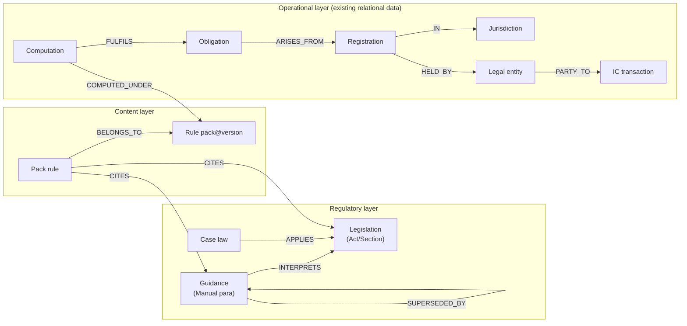

# 04 — Knowledge Graph

## 1. What the graph is for (FR-405, honestly scoped)

Multi-hop questions that flat retrieval answers poorly:
- *"Which of our obligations are affected by the change to VIT13500?"* (source → rules citing it → obligations computed under those rules → entities)
- *"Which entities transact with counterparties in jurisdictions where we have no WHT registration?"* (entity → IC transactions → counterparty → jurisdiction → registration gap)
- *"What does this partial-exemption position depend on?"* (position → rule → legislation → case law)

Note what these have in common: **most hops traverse structured platform data** (entities, registrations, obligations, rules, transactions) that already lives in PostgreSQL with foreign keys — not free text. That observation drives the phased decision.

## 2. Graph model (store-independent by design)

Edge properties carry temporal validity (`valid_from/to`) matching the corpus model — graph queries are as-of-dated like everything else.

## 3. Store evaluation: Neo4j vs relational-graph vs pg extensions

| Criterion | Neo4j | PostgreSQL recursive CTEs over edge tables | Apache AGE (pg extension) |
|---|---|---|---|
| Traversal expressiveness | ★★★★★ Cypher is the right language for ≥4-hop, variable-path queries | ★★★☆☆ CTEs handle fixed-shape ≤4-hop paths fine; variable-length paths get painful | ★★★☆☆ Cypher-in-Postgres, but maturity/ops story is weak |
| Data locality | ✗ Second store: every hop over operational data must be **synced** from Postgres (CDC/outbox projection) — a new consistency surface with tenant isolation to re-implement | ★★★★★ The operational layer *is already there* with RLS intact | ★★★★☆ Same DB, but extension support on Azure Flexible Server is limited |
| Ops & security | New cluster, backup/DR story, licence (AuraDB or self-managed), separate RBAC | Zero new infra; existing controls apply | Extension availability risk on managed Azure |
| Fit to actual query set (§1) | Overqualified: our known queries are 3–5 fixed-shape hops | Sufficient for the enumerated set | Sufficient but risky platform |

## 4. Decision (ADR-014): relational-first, Neo4j behind a proven-need gate

**R2–R3:** implement the graph as **first-class edge tables in PostgreSQL** (`kg_edge(from_ref, to_ref, kind, valid_from, valid_to, provenance)`) populated by: pack publication (RULE→CITES→source, from ADR-005's per-rule citations), corpus ingestion (GUID→INTERPRETS/SUPERSEDED_BY), and existing FKs *virtually* (operational edges need no copy — a view layer exposes them as edges). Traversals ship as **named, tested query functions** (`affected_obligations(source_ref, as_of)`, `registration_gaps(entity_set)`) exposed as Tool Gateway tools — agents call semantic questions, not raw graph queries (consistent with ADR-012: enumerable capabilities, not open query surfaces).

**R4 gate:** adopt **Neo4j** when either trigger fires: (a) a required traversal is variable-depth/pattern-shaped beyond CTE ergonomics (e.g. open-ended structure discovery for TP), or (b) graph query volume/latency measurably strains Postgres. The Neo4j design is pre-committed so adoption is execution, not research: AuraDB on Azure; projection via the existing outbox (`KnowledgeUpdated`, pack-publication, masterdata events → graph sync consumer); node/edge model exactly §2; tenant isolation via per-tenant databases (Aura) mirroring ADR-006's premium path; the named-query tool layer is the seam — **agents and tools do not change when the store does.**

Why not Neo4j from day one, given the brief names it? Because the honest reading of our query inventory says a second stateful store with a sync pipeline would be maintained for queries Postgres already answers — and "we run Neo4j" is a weaker interview story than "we defined the graph seam, measured the need, and pre-planned the migration." The ADR records both the restraint and the readiness.

## 5. GraphRAG (retrieval enrichment)

Where the graph improves RAG at R3+, behind the same `Retriever` port:
- **Citation-neighbourhood expansion:** retrieved chunk → pull directly-linked nodes (interpreting guidance, superseding version, citing pack rules) as *candidate* context, reranked with everything else — never force-included.
- **Impact-aware ranking:** chunks whose nodes link to the querying run's obligations get a bounded rank boost (relevance via the tenant's actual footprint).
- **Conflict surfacing:** SUPERSEDED_BY edges let assembly warn when a retrieved chunk has a newer version outside the as-of window — presented, not auto-substituted.

Each enrichment lands only if it moves `research-qa` metrics (doc 03 §5) — graph features earn their complexity through evals like everything else.
