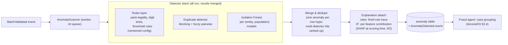

# 02 — Fraud & Anomaly Detection

## 1. Pipeline architecture (R1)

Scans are idempotent per (batch-set, detector-version) — re-scanning after a detector upgrade creates a new scored generation, never silently overwrites (reproducibility, ML-4).

## 2. Duplicate & near-duplicate detection (US-801: ≥13/14 seeded)

Two-stage, deliberately not-ML:
1. **Blocking:** candidate pairs via cheap keys — same vendor ± same absolute amount band ± date window (±10d), plus cross-vendor block on (amount, date) for split-vendor duplicates. Keeps pairwise work O(candidates), not O(n²).
2. **Pairwise scoring:** weighted fuzzy comparison — invoice-number similarity (token + edit distance, prefix/suffix stripped), amount delta (exact / ±rounding / ±2%), date proximity, PO/reference overlap, vendor identity vs resolved-entity identity (catches duplicates across vendor records — hook into entity resolution, doc 03 §4). Score bands: `EXACT`, `STRONG`, `POSSIBLE` → anomaly severity; every pair explains its component scores (the reviewer sees *why* these two match).

Disposition feedback tunes band thresholds per tenant (legitimate recurring instalments get dismissed with reason `RECURRING_CONTRACT` → future pairs matching that vendor+pattern surface at lower severity with prior-disposition citation — the *Fraud agent* handles this at case level; the detector stays untouched until threshold review).

## 3. Outlier detection — Isolation Forest (ADR-017)

- **Population design is the real modelling decision:** one global model would flag every large entity's normal as another's outlier. Models are fit per (entity, transaction-population) where population = tax-code family × direction (AP/AR); minimum population size 5k rows, else fallback to rules-only (small populations get robust z-scores, not a forest fit to noise).
- Features: doc 01 §3 families, robust-scaled within population. Contamination: not assumed — score distribution kept continuous; the *alert threshold* is set by alert budget (ML-5), decoupling "how anomalous" from "how many we can review".
- Retraining: per period-close per population, versioned per fit (population stats in the registry); score stability monitored across refits (a refit that reshuffles the queue ranking gets quarantined for review before serving).
- **Why Isolation Forest first (vs autoencoder / one-class SVM / LOF):** IF handles mixed-scale tabular features without distance-metric tuning, trains in seconds per population, degrades gracefully on small data, and its axis-parallel splits yield *faithful* per-feature attributions (TreeSHAP-compatible in R2). Autoencoders need more data per population, GPU-friendly infra, careful threshold calibration, and their reconstruction-error attributions are weaker evidence for a reviewer. **Autoencoder gate (recorded in ADR-017):** introduce as a challenger when (a) populations exceed ~100k rows with suspected *interaction-shaped* anomalies IF misses (measured via disposition analysis of false negatives), or (b) sequence/temporal patterns (e.g. structured splitting just under approval limits over time) require representation learning. Until evidence demands it, IF + rules is the defensible, explainable floor.

## 4. Rules layer (permanently in service)

Versioned YAML config (same governance as packs — reviewed, effective-dated): pack-derived legality checks (rate × code consistency, reverse-charge markers), round-number & just-below-threshold tests, weekend/period-end posting patterns, digit-distribution (first-two-digit deviation per population — Benford honestly applied: flagging *populations*, not individual rows), velocity rules (vendor invoice frequency spikes). Rules are cheap, explainable, and encode institutional knowledge that no model cold-starts with — they are not scaffolding to remove but a permanent detector class (Rung 4 keeps them running).

## 5. Vendor risk (FR-501, composite)

`vendor_risk_score` = weighted composite (weights versioned config, R1) over: anomaly-case history (confirmed rate, recency-decayed), coding-entropy vs peer vendors, duplicate involvement, round-number ratio, new-vendor/dormant-reactivation flags, master-data hygiene (missing VAT number, bank-account changes, shared identifiers across vendors — the classic fraud tells), concentration (spend share trend). R2 adds a GBM lift model over the same features once dispositions accumulate (doc 03 §2 shares the pipeline). Score surfaces in the Fraud Centre vendor view and as Fraud-agent context (`get_vendor_history`), with component breakdown always visible — a composite that can't show its parts is a rumor, not a score.

## 6. Detector acceptance targets (CI-gated on golden sets)

| Detector | Target |
|---|---|
| Duplicates | ≥13/14 seeded pairs (US-801); false-pair rate <5% on clean fixtures |
| Rules layer | 100% of seeded rule-class violations (deterministic — anything less is a bug) |
| Isolation Forest | ≥85% seeded-outlier recall @ alert-budget threshold on synthetic populations; ranking stability (Kendall-τ ≥0.9 across seeded refits) |
| Vendor risk | Seeded risky-vendor set ranks in top decile |
| End-to-end | `AnomalyDetected` → Fraud-agent case → queue visible < 5 min post-validation |
