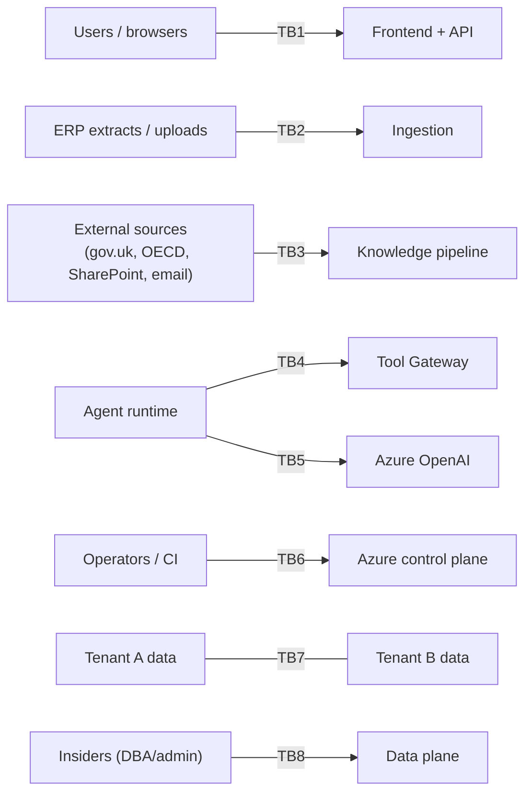

# 01 — Threat Model

## 1. Trust boundaries (numbered; referenced throughout the phase)

## 2. STRIDE per boundary (condensed matrix; ✔ = control exists + test exists)

| Boundary | S | T | R | I | D | E | Key controls (verification ref) |
|---|---|---|---|---|---|---|---|
| TB1 user↔API | Token theft, session fixation | Request tampering | "I didn't do that" | Over-fetch, IDOR | Floods | Role escalation | PKCE+BFF httpOnly ✔, short JWT+revocation ✔, ETag/hash binding ✔, audit chain ✔, response_model filtering ✔, cursor-HMAC ✔, rate limits ✔, RBAC walk-test ✔ (04 §2) |
| TB2 data ingestion | Spoofed uploads | File tampering, CSV injection | Upload denial | Payload snooping | Zip-bombs, floods | Path traversal | AuthZ+entity scope ✔, content-hash+manifest ✔, size caps/AV/type allow-list ✔, server-side names ✔, formula-escape on any CSV export ✔, per-tenant upload limits ✔ |
| TB3 corpus | Fake source impersonation | Poisoned documents (→ 02) | — | Licence leakage | Ingestion floods | **Injection via content** (→ 02) | Source allow-lists+manifests ✔, curation gates ✔, injection screening ✔, licence classes ✔ |
| TB4 agent→gateway | Forged agent identity | Envelope tampering | Untraced actions | Scope escape | Tool-call storms | **Capability escape** | Per-service MI+client-creds ✔, server-side grant check ✔, mandatory RunTracer ✔, run-scoped budgets ✔, **no privileged endpoints exist** ✔ (04 §3 attack suite) |
| TB5 agent→LLM | — | Response manipulation | — | **PII/data egress** | Provider outage | Output-driven actions | Pseudonymisation ✔, egress allow-list (network) ✔, structured-output validation ✔, no-training terms ✔, circuit breaker ✔ |
| TB6 ops/CI | Stolen deploy identity | Malicious pipeline/image | Unattributed deploys | State-file secrets | — | Runner→prod escalation | OIDC subject-scoped federation ✔, image signing+verify ✔, env protection+review ✔, minimal TF outputs+locked state ✔, release BOM ✔ |
| TB7 tenant↔tenant | — | — | — | **Cross-tenant read/write** | Noisy neighbour | — | RLS FORCE ✔ + app predicate ✔ + tenant-keyed caches ✔ + WS scope filter ✔ + storage path scoping ✔; attack suite (04 §2) ✔; per-tenant limits ✔ |
| TB8 insiders | — | **History rewrite, evidence tampering** | Admin denial | Bulk exfiltration | — | Self-grant | Append-only+trigger guards ✔, hash chain+WORM anchors ✔, PIM JIT elevation ✔, role-change SoD warnings+audit ✔, egress monitoring (enterprise) ◐ |

◐ = partial at MVP, tracked in the risk register (§4).

## 3. Top attack trees (the three that matter most)

**AT-1: Exfiltrate tenant data via the agent surface** (the novel one)
Root: attacker-controlled text (invoice memo / knowledge doc / user chat) → prompt injection → (a) agent calls tools out of scope → **blocked**: server-side grants + entity-scope on every gateway call + IAM (3 layers); (b) agent encodes data into narrative output for an external channel → **blocked**: agents have no external channels (no email/web tools exist; reports gated behind human approval); (c) agent leaks into LLM provider → **mitigated**: pseudonymisation + enterprise no-training terms; residual: provider compromise (accepted, contractual). Detection: tool-403 telemetry spike, invariant scope-containment violations.

**AT-2: Corrupt a filed figure** (the compliance killer)
Paths: tamper computation post-approval → **blocked**: immutability guards + approval hash-void + chain; poison rule pack → **blocked**: signature + hash pinning + PR review + effective-dating; tamper lineage upstream → **blocked**: batch immutability post-validation + content hashes; compromise engine code via supply chain → **mitigated**: lockfiles, dep scanning, signed images, review; residual: malicious insider with merge rights (accepted: SoD on review + anchored audit makes it *attributable*, which is the realistic defence).

**AT-3: Silent cross-tenant read** (the trust killer)
Paths: app-bug missing filter → **blocked**: RLS backstop; RLS misconfig on new table → **blocked**: migration checklist + CI test that every business table has a policy (schema introspection test); cache bleed → **blocked**: tenant-in-key convention + test; WS mis-subscription → **blocked**: server-side scope filter + test; blob URL guessing → **blocked**: no public containers, time-boxed SAS scoped per tenant path. Detection: canary rows per tenant (queries returning foreign canaries alert — cheap and brutal).

## 4. Risk register (accepted/partial residuals — reviewed quarterly)

| ID | Residual risk | Level | Treatment |
|---|---|---|---|
| R-01 | LLM provider data handling beyond contract | Low-Med | Pseudonymisation + Azure OpenAI enterprise terms; monitor provider attestations |
| R-02 | Insider with code-merge rights | Med | SoD review, protected branches, attributable-by-design (anchored chain); enterprise: mandatory dual review on `compliance/` + `authz/` paths |
| R-03 | Egress/DLP monitoring not built at MVP | Med | TB8 ◐; enterprise tier: Purview/DLP integration on storage + Log Analytics exfil analytics |
| R-04 | Dynamic egress IPs (no NAT at MVP) | Low | Phase 8 doc 02; NAT gateway option costed |
| R-05 | Dev-issuer misuse if enabled outside local/demo | Low | Issuer allow-list per env in Settings validation; CI asserts prod config has Entra only |
| R-06 | DoS at application layer beyond rate limits | Low-Med | ACA scale + limits at MVP; Front Door WAF + bot rules in enterprise tier |
